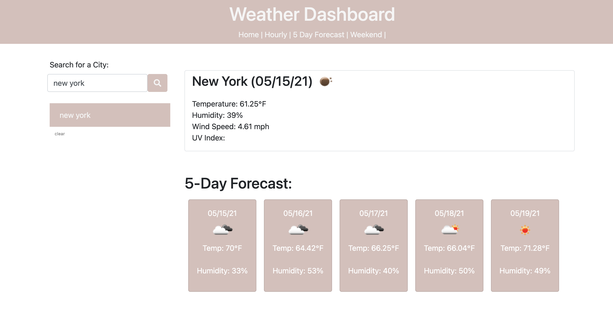

# Weather-Dashboard

  
 
  ## Description
  In this assignment we were required to create a weather dashboard that would show the weather for whichever city you looked up, along with it's 5 day forcast.

  ## User Story

  As A traveler
  I WANT to see the weather outlook for multiple cities
  SO THAT I can plan a trip accordingly

  ## Acceptance Criteria

  GIVEN a weather dashboard with form inputs
  WHEN I search for a city
  THEN I am presented with current and future conditions for that city and that city is added to the search history
  WHEN I view current weather conditions for that city
  THEN I am presented with the city name, the date, an icon representation of weather conditions, the temperature, the humidity, the wind speed, and the UV index
  WHEN I view the UV index
  THEN I am presented with a color that indicates whether the conditions are favorable, moderate, or severe
  WHEN I view future weather conditions for that city
  THEN I am presented with a 5-day forecast that displays the date, an icon representation of weather conditions, the temperature, and the humidity
  WHEN I click on a city in the search history
  THEN I am again presented with current and future conditions for that city

  * Please see image below for a visual of the functioning app.
  
  

  * Please see link below for for deployed app.
  
  [Weather Dashboard](https://crystal-g-b.github.io/Weather-Dashboard/)

  In order to retrieve the weather data for cities, I used the OpenWeather API. Then all previous searches are stored in `localStorage

  ## Contact-Information
  * GitHub: [crystal-g-b](https://github.com/crystal-g-b)
  * Email: crystal.barnett1@gmail.com
  ## License:
  
